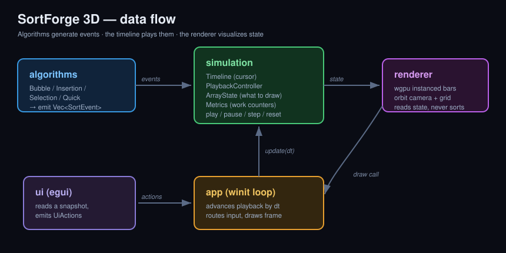

# SortForge 3D

A real-time 3D sorting algorithm visualization engine written in **Rust** and **wgpu**.

[](https://www.rust-lang.org/)
[](https://wgpu.rs/)
[](LICENSE)

SortForge 3D renders an array as a field of animated 3D bars and lets you watch
classic sorting algorithms work — comparison by comparison, swap by swap — with
full playback control and live metrics. It is built not as a toy demo but as a
small, cleanly-architected real-time visualization engine.



> **Screenshots / GIF:** add captures to `docs/screenshots/` and link them here,
> e.g. ``.

---

## Why this project exists

It is a focused demonstration of several things at once:

- **Algorithm simulation** decoupled from rendering via an event model.
- **Real-time GPU rendering** with `wgpu` (instanced draws, depth testing, a
  custom WGSL shader, a procedural grid).
- **Event-based architecture** that makes playback, stepping, and replay fall
  out naturally.
- **Clean, modular Rust** with documented design boundaries and unit tests that
  prove the algorithms are correct.

The guiding idea, kept consistent throughout the codebase:

> **Algorithms generate events. The timeline plays events. The renderer
> visualizes state.**

---

## Features

- 🧊 **3D GPU-rendered visualization** — each array element is an instanced,
  lit cuboid; the whole array draws in a single instanced call.
- 🎞️ **Event-based sorting timeline** — algorithms emit a flat `Vec<SortEvent>`;
  nothing renders or mutates shared state directly.
- 🔢 **Four algorithms** — Bubble, Insertion, Selection, and Quick sort, each
  emitting meaningful, distinct events.
- 🎛️ **Full playback control** — play, pause, single-step, reset, and a
  logarithmic speed slider (1–2000 events/sec).
- 🎨 **Readable visual states** — normal, comparing, swapping/writing, pivot /
  running-minimum, and finalized (sorted).
- 📊 **Live metrics** — comparisons, swaps, writes, current/total step,
  progress, array size, and FPS, all derived from the event stream.
- 🛰️ **Orbit camera** — drag to orbit, scroll to zoom; resizes correctly.
- 🧩 **egui control panel** with a color legend and keyboard-shortcut reference.

---

## Architecture overview

The crate is organized as a small engine with a strict, one-directional flow.
Each layer has a single job and does not reach across boundaries.

```
src/
├── main.rs                 # entry point + logging
├── app.rs                  # winit event loop, input, per-frame update (the wiring)
│
├── algorithms/             # pure event GENERATORS — never render, never share state
│   ├── mod.rs              #   SortingAlgorithm trait, Algorithm enum, Recorder helper
│   ├── bubble_sort.rs
│   ├── insertion_sort.rs
│   ├── selection_sort.rs
│   └── quick_sort.rs
│
├── simulation/             # the event MODEL and playback
│   ├── sort_event.rs       #   SortEvent, ElementState  (the architectural keystone)
│   ├── array_state.rs      #   replayable values + per-element highlight state
│   ├── metrics.rs          #   work counters, folded from events
│   ├── timeline.rs         #   ordered events + a playback cursor
│   └── playback.rs         #   PlaybackController: play/pause/step/reset/speed
│
├── renderer/               # the wgpu CONSUMER — reads state, never sorts
│   ├── renderer.rs         #   surface, pipelines, instance buffer, frame draw
│   ├── camera.rs           #   orbit camera + CameraUniform
│   ├── mesh.rs             #   unit cube + ground quad geometry
│   ├── instance.rs         #   InstanceRaw + array→world BarLayout
│   └── shader.wgsl         #   bar lighting + procedural ground grid
│
├── ui/                     # egui control panel — reads a snapshot, emits intent
│   └── controls.rs         #   UiActions / UiState
│
└── utils/                  # leaf helpers
    ├── color.rs            #   sRGB→linear palette + state→color mapping
    └── timing.rs           #   frame delta + smoothed FPS
```

### The three roles

1. **Algorithms → events.** Each algorithm implements `SortingAlgorithm` and
   returns a `Vec<SortEvent>` (`Compare`, `Swap`, `Overwrite`, `SetPivot`,
   `MarkSorted`, `ClearHighlights`, `AlgorithmFinished`). A small `Recorder`
   applies value mutations to a working copy *and* records the event, so the
   recorded stream is guaranteed to match the work performed. Adding a new
   algorithm requires touching neither the simulation nor the renderer.

2. **Timeline → playback.** The `PlaybackController` runs the chosen algorithm
   **once** to build a `Timeline`, then plays it purely by advancing a cursor
   and calling `ArrayState::apply` on each event. Because applying events from
   the original array is deterministic, the state is fully *replayable* — which
   is exactly what makes pause, step, reset, and speed control trivial.

3. **State → pixels.** The `Renderer` is handed a `Camera`, an `ArrayState`, and
   a `BarLayout` each frame and draws them. It has no knowledge of sorting,
   playback, or *why* an element is a given color.

This separation is the point of the project: the renderer never imports an
algorithm, and an algorithm never imports the renderer.

---

## How to run

Requires a recent Rust toolchain and a GPU with a Vulkan / Metal / DX12 / GL
backend (whatever `wgpu` can reach).

```bash
# clone, then:
cargo run --release
```

A window titled **SortForge 3D** opens with the array already animating. Use the
panel on the left or the keyboard to drive it.

```bash
# run the test suite (algorithm correctness + playback invariants)
cargo test

# extra logging
RUST_LOG=sortforge_3d=debug cargo run --release
```

---

## Controls

| Input            | Action                          |
| ---------------- | ------------------------------- |
| `Space`          | Play / Pause                    |
| `→` (Right)      | Step one event                  |
| `R`              | Generate a new random array     |
| `↑` / `↓`        | Speed up / slow down            |
| `1` `2` `3` `4`  | Bubble / Insertion / Selection / Quick |
| Left-drag        | Orbit the camera                |
| Scroll wheel     | Zoom                            |

Everything is also available in the egui panel: algorithm selector, array-size
slider, new-array button, play/pause/step/reset, speed slider, and a live
metrics + color-legend readout.

### Color legend

| State                  | Color           |
| ---------------------- | --------------- |
| Normal                 | Blue / cyan     |
| Comparing              | Yellow          |
| Swapping / writing     | Orange          |
| Pivot / current minimum| Magenta         |
| Sorted (finalized)     | Green           |

---

## How the algorithms emit events

Each algorithm is written for clarity and to produce a *visually legible* event
stream (not necessarily the theoretically optimal variant):

- **Bubble sort** — compares adjacent pairs, swaps when out of order, and marks
  the largest element of each pass as sorted (the green tail grows inward). It
  stops early if a pass performs no swaps.
- **Insertion sort** — the *shift* formulation: each key walks left via
  `Overwrite` shifts, with one final `Overwrite` to drop it home. The prefix is
  only finalized once the whole array is ordered (marking it earlier would be a
  lie, since later insertions still shift it).
- **Selection sort** — highlights the running minimum as a magenta pivot, scans
  the unsorted region, swaps the true minimum to the front, and locks in the
  front element (the green region grows from the left).
- **Quick sort** — Lomuto partitioning: pins the pivot, compares each element
  against it, swaps smaller elements forward, then marks the pivot's final
  position sorted before recursing.

---

## Testing

Correctness is verified at the event level, which is the credible thing to test:

- For **every algorithm** across a spread of inputs (already-sorted, reversed,
  duplicates, single-element, empty, and a larger pseudo-random array), the
  generated events are **replayed through `ArrayState`** and asserted to produce
  a genuinely sorted result that is a **permutation of the input** with every
  element flagged sorted.
- **Metrics** are checked to match exact event counts.
- **Playback** invariants are tested: a full play-through sorts the array,
  `reset` restores the original array and zeroes metrics, switching algorithms
  rebuilds and rewinds, and `update(dt)` advances proportionally to speed.

```bash
cargo test
```

---

## Future roadmap

- [ ] Merge Sort and Heap Sort
- [ ] Radix Sort
- [ ] Side-by-side algorithm **race mode**
- [ ] Smooth positional interpolation when bars swap
- [ ] Heightmap / terrain visualization mode
- [ ] Particle effects on swaps
- [ ] Export run metrics to JSON
- [ ] WebAssembly / WebGPU build
- [ ] GPU compute **Bitonic Sort** experiment
- [ ] Headless benchmark mode (no rendering)

The event-based design is what makes most of these additive: a new algorithm is
a new `SortingAlgorithm`, and a race mode is just multiple `PlaybackController`s.

---

## What this project demonstrates

SortForge 3D is a compact but complete systems-and-graphics project. It shows
idiomatic, modular Rust; a custom real-time `wgpu` renderer (instancing, depth,
a hand-written WGSL shader, an orbit camera, and an egui overlay composited in a
second render pass); and — most importantly — a deliberate **event-driven
architecture** that cleanly separates *what an algorithm does* from *how it is
animated*. That separation is what gives it replay, stepping, and metrics
essentially for free, and what makes it straightforward to extend.

## License

Licensed under the [MIT License](LICENSE).
